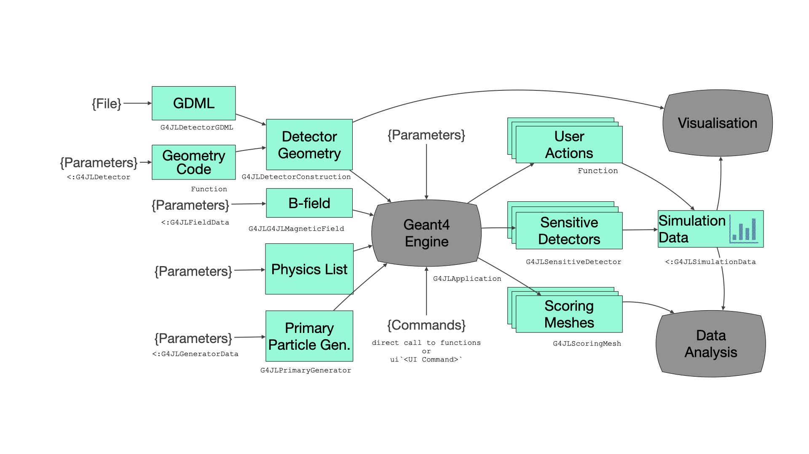

# Geant4.jl

Julia bindings for the [Geant4](https://geant4.web.cern.ch) particle transportation toolkit. It is using [CxxWrap.jl](https://github.com/JuliaInterop/CxxWrap.jl) package to wrap C++ types and functions to Julia. Since the Geant4 toolkit is rather large and complex, writing the wrapper code by hand is not really an option. For this we use the package [WrapIt](https://github.com/grasph/wrapit) that automates the generation of the wrapper code making use of the clang library.

Documentation of the concepts and how to write applications with the Geant4 toolkit can be found with the [Application Developer Guide](https://geant4-userdoc.web.cern.ch/UsersGuides/ForApplicationDeveloper/html/index.html) or the [Classes and Members reference guide](https://geant4.kek.jp/Reference/v11.1.1/index.html) for a detailed description of each C++ class. In this document we will only highlight the differences between the Julia and the C++ API. We will document the additional types that have been added on top of the C++ classes to make the user interface more Julia friendly. To distinguish these new types from the types coming directly from C++ via the CxxWrap wrappers, these types are prefixed with `G4JL`.

## Installation
The Geant4.jl package does no require any special installation. Stable releases are registered into the Julia general registry, and therefore can be installed with the standard `Pkg` Julia package manager.

To use and play with the examples on this package, the user can clone this repository and setup a complete Julia environment with:

- `git clone https://github.com/JuliaHEP/Geant4.jl.git`
- `julia --project=Geant4.jl/examples -e 'import Pkg; Pkg.instantiate()'`

## Getting started
Import the `Geant4` module. All the wrapped Geant4 classes are exported since they are prefixed by `G4` minimizing the chances of a name clash with other Julia symbols. 
```julia-repl

julia> using Geant4
julia> runManager = G4RunManager()
**************************************************************
 Geant4 version Name: geant4-11-01-patch-01 [MT]   (10-February-2023)
                       Copyright : Geant4 Collaboration
                      References : NIM A 506 (2003), 250-303
                                 : IEEE-TNS 53 (2006), 270-278
                                 : NIM A 835 (2016), 186-225
                             WWW : http://geant4.org/
**************************************************************

Geant4.G4RunManagerAllocated(Ptr{Nothing} @0x00007f9fcb6f9c50)

julia> methodswith(G4RunManager, supertypes=true)
[1] convert(t::Type{G4RunManager}, x::T) where T<:G4RunManager in Geant4 at /Users/mato/.julia/packages/CxxWrap/IdOJa/src/CxxWrap.jl:676
[2] AbortEvent(arg1::Union{CxxWrap.CxxWrapCore.CxxRef{<:G4RunManager}, Union{CxxWrap.CxxWrapCore.SmartPointer{T2}, T2} where T2<:G4RunManager}) in Geant4 at /Users/mato/.julia/packages/CxxWrap/IdOJa/src/CxxWrap.jl:618
...
[94] rndmSaveThisRun(arg1::Union{CxxWrap.CxxWrapCore.CxxRef{<:G4RunManager}, Union{CxxWrap.CxxWrapCore.SmartPointer{T2}, T2} where T2<:G4RunManager}) in Geant4 at /Users/mato/.julia/packages/CxxWrap/IdOJa/src/CxxWrap.jl:618

julia> v = GetVersionString(runManager)
ConstCxxRef{G4String}(Ptr{G4String} @0x00007ffed34df2d8)

julia> String(v)
" Geant4 version Name: geant4-11-01-patch-01 [MT]   (10-February-2023)"
```
Note that class methods are called with the object instance as first argument. In C++ the `GetVersionString` method would be called as `runManager->GetVersionString()` while in Julia it is called as `GetVersionString(runManager)`. Thanks to the Julia multi-dispatch we do not need to prefix the methods with the module name `Geant4.GetVersionString(runManager)`, even for very common function names such as `mag`.
```julia-repl
julia> v = G4ThreeVector(1,2,3)
Geant4.CLHEP!Hep3VectorAllocated(Ptr{Nothing} @0x00007f9fcaf2a710)

julia> mag(v)
3.7416573867739413
```

## Geant4 Julia interface
The main goal for defining a Geant4 application in the Julia interface is to create an instance of the [`G4JLApplication`](@ref) type, where all the needed elements for running a Geant4 application are declared, such as the detector geometry, the physics list, the primary particle generator, the type of run manager, the user actions, etc. 



These are the needed elements:
- **detector**. An instance of a detector structure inheriting from the abstract type `G4JLDetector`, in which all the detector parameters are defined. The user should also provide a method specialization of `Geant4.getConstructor(::G4JLDetector)::Function` to return the Julia function that toolkit needs to call in order to construct the geometry and return the pointer of the 'world' physical volume. There is no default.
- **field**. An instance of the magnetic field class. The ` G4JLUniformMagField(...)` function provides a uniform magnetic field. See later how to define a custom one.
- **simdata**. An instance of the simulation data structure that the program will need to collect during the simulation execution. This mutable structure needs to inherit from the abstract type `G4JLSimulationData` and is completely user defined with counters, data structures to collect the hits or doses, histograms, etc. The default is an instance of type `G4JLNoData`.
- **nthreads**. Number of worker threads to be used. The default is 0, which means serial mode. Any number > 0 will use the MT functionality of Geant4, and therefore the user would need to pay attention to the user actions that are run concurrently to avoid data races (see [Julia doc on multi-threading](https://docs.julialang.org/en/v1/manual/multi-threading/#Data-race-freedom))
- **verbose**. Verbosity level (for physics list). The default is 0.
- **physics_type**. The physics list predefined type. Default is `FTFP_BERT`.
- **generator_type**. The primary generator generator type. The default is `G4JLParticleGun`, which encapsulates a `G4ParticleGun`. The underlying `G4ParticleGun` can be obtained by calling `GetGun()`.
- **user actions**. Julia methods defining the different possible user actions (e.g. stepping action, tracking action, run action, event action). The default is no action.
- **sdetectors**. List of sensitive detectors. This is given as a `Vector` of pairs `lv::String => sd::G4JLSensitiveDetector` to associate logical volumes by name to sensitive detector instances (see next section).
- **scorers**. List of scoring meshes defined with the function [`G4JLScoringMesh`](@ref).

Once the `G4JLApplication` is instantiated (and implicitly an instance of the `G4RunManager` created), the user can control the application with the following commands:
- `configure(::G4JLApplication)`. It associates the physics list, generator and user actions to the selected `G4RunManager` instance. 
- `initialize(::G4JLApplication)`. It basically calls the `Initialize()` method of the run manager and associate the declared sensitive detectors.
- `reinitialize(::G4JLApplication, ::G4JLDetector)`. It re-defines the declared detector geometry with a new instance of `G4JLDetector`. 
- ` beamOn(::G4JLApplication, ::Int)`. Starts a run with a given number of events.

### Constructing the detector
Parameters of the detector are collected in a user defined mutable data structure inheriting from `G4JLDetector`. The user also needs to provide a Julia method for constructing the geometry. This method needs to have the signature
```julia
<User_Det_Constructor_Function>(::G4JLDetector)::CxxPtr{G4VPhysicalVolume}
```
The only argument of the function gives access to the user defined structure with all the detector parameters.
!!! note
    The type `CxxPtr{G4VPhysicalVolume}` denotes a C++ pointer to the `G4VPhysicalVolume` type.
The user can use the native G4 classes for constructing the geometry such as the different type of solids (e.g. G4Box, G4Tubs, etc.), `G4LogicalVolume`, `G4PVPlacement`, `G4PVReplica`, etc. Alternatively can the type [`G4JLDetectorGDML`](@ref) to construct a detector from a GDML file.

!!! note
    Note that by default constructed C++ objects from Julia would get automatically deleted by the Julia garbage collector (GC) since a `finalizer` gets installed to the wrapper classes. This is particularly a problem when constructing the geometry.
  
Currently for the following classes have the `finalizer` disabled in the wrapper: `G4PVPlacement`, `G4LogicalVolume`, `G4PVReplica`, `G4Material`, `G4Isotope`, `G4Element`. This means that instances of them will not be deleted by Julia to avoid double deletion (often a crash) when the geometry gets deleted at the finalization of the application from the C++ side. 

A pointer to any of the `G4Solid` needs to be passed to the `G4LogicalVolume` using [`move!(objref)`](@ref) function to transfer the ownership of the referenced object to the C++ side. See the following example:
```julia
trackerS = G4Tubs("tracker", 0, trackerSize, trackerSize, 0, 360deg)
trackerLV = G4LogicalVolume(move!(trackerS), m_air, "Tracker")
G4PVPlacement(nothing,              # no rotation
    G4ThreeVector(0,0,0),           # at (0,0,0)
    trackerLV,                      # its logical volume
    "Tracker",                      # its name
    worldLV,                        # its mother  volume
    false,                          # no boolean operations
    0,                              # copy number
    checkOverlaps)                  # checking overlaps
```
### Physics List
The user can provide one of the pre-defined physics lists, such as `QGS_BIC`, `QBBC` or `FTFP_BERT`. Alternatively, the user can define a Julia `struct`` as a subtype of `G4VUserPhysicsList` and modify some of the physcis in the constructor. For example:
```julia
struct ScintPhysicsList <: G4VUserPhysicsList
    function ScintPhysicsList(verbose)
        pl = FTFP_BERT(verbose)
        # replace G4EmStandardPhysics
        ReplacePhysics(pl, move!(G4EmStandardPhysics_option4(verbose)))
        # register G4OpticalPhysics
        RegisterPhysics(pl, move!(G4OpticalPhysics(verbose)))
        # activate  scintillation
        optpar = G4OpticalParameters!Instance()
        SetProcessActivation(optpar, "Scintillation", true)
        # activate cherenkov radiation
        SetProcessActivation(optpar, "Cerenkov", true)
        return pl
    end 
end
```

### Magnetic field
The user can define either an uniform magnetic field or a custom one. To define an custom one:
- define first a user structure for the parameters that inherits from the abstract type `G4JLFieldData`
- then, define a function with the signature `(result::G4ThreeVector, position::G4ThreeVector, params::G4JLFieldData)::Nothing`
- and finally, with all this, instantiate the magnetic field calling the function 
  ```
    G4JLMagneticField(<name>, <data>; getfield_method=<function>)
  ```
### Primary Particle Generator
The user can define either a custom primary particle generator or use one of the two defined ones:
- **G4JLGunGenerator**. Uses the `G4ParticleGun` class of Geant4 that generates a single particle type with a fix kinetic energy, position and direction.
  ```julia
  G4JLGunGenerator(particle = "proton", 
                   energy = 3GeV, 
                   direction = G4ThreeVector(0,0,1), 
                   position = G4ThreeVector(0,0,-2940.0))
  ```
- **G4JLGeneralParticleSource**. Uses the `G4GeneralParticleSource` class of Geant4 to generate one of more sources of primary particles with predefined distributions for energy, position and direction. An example can be:
  ```julia
  src1 = (particle="e+", intensity=0.5,
          ene=(type="Exp", min=2MeV, max=10MeV, ezero=2.),
          pos=(type="Plane", shape="Circle", centre=G4ThreeVector(1cm,2cm,0cm), radius=3cm),
          ang=(type="cos", mintheta=0deg, maxtheta=180deg))
  src2 = (particle="gamma", intensity=0.5,
          ene=(type="Brem", min=2MeV, max=10MeV, temp=2e12),
          pos=(type="Plane", shape="Ellipse", centre=G4ThreeVector(3cm,1cm,0cm), halfx=1cm, halfy=2cm),
          ang=(type="iso", mintheta=0deg, maxtheta=180deg))
  gps = G4JLGeneralParticleSource(sources = [ src1, src 2 ])
  ```
  the standard particle gun parameters works as well:
  ```julia
  G4JLGeneralParticleSource(particle = "proton", 
                            energy = 3GeV, 
                            direction = G4ThreeVector(0,0,1), 
                            position = G4ThreeVector(0,0,0))
  ```

### User Actions
User actions are native Julia functions that are callbacks of the Geant4 toolkit. They are declared in the constructor of `G4JLApplication`, so they do not need to be associated to a specific function name. All user actions receive a reference to the `G4JLApplication` from which the user can obtain details of the actual application, such as the current detector, the physics, the generator, or the running simulation data. There are the available attributes of the application instance:
```julia
    runmanager::G4RunManager    # The C++ G4RunManager instance
    detector::DET               # User defined detector structure with all parameters
    simdata::Vector{DAT}        # User defined simulation data structs (each worker has its own)
    physics::G4VUserPhysicsList # Physics List
    generator::G4JLPrimaryGenerator # Primary particle generator
    field::Union{G4Field, G4JLMagneticField} # Magnetic field instance
    evtdisplay::G4JLDisplay     # Event display instance
    nthreads::Int32             # number of worker threads
    verbose::Int32              # verbosity level for physics lists
    sdetectors::Dict{String,Vector{G4JLSensitiveDetector}} # dictionary of sensitive detectors
    scorers::Vector{G4JLScoringMesh} # vector of scoring meshes
```
The following are the currently defined possible user actions:
- **stepping action**. Called on each simulation step. The signature is `(::G4Step, ::G4JLApplication)::Nothing`. Consult the [G4Step](https://geant4.kek.jp/Reference/v11.1.1/classG4Step.html) reference manual to see what you can get from it. 
- **pre-tracking action**. Called at the creation of a new participle being tracked. The signature is `(::G4Track, ::G4JLApplication)::Nothing`. Consult the [G4Step](https://geant4.kek.jp/Reference/v11.1.1/classG4Track.html) reference manual to see what you can get from it.
- **post-tracking action**. Called at the end of the particle being tracked. The signature is `(::G4Track, ::G4JLApplication)::Nothing`. Consult the [G4Track](https://geant4.kek.jp/Reference/v11.1.1/classG4Track.html) reference manual to see what you can get from it.
- **begin-event action**. Called at the beginning of each event. The signature is `(::G4Event, ::G4JLApplication)::Nothing`. Consult the [G4Event](https://geant4.kek.jp/Reference/v11.1.1/classG4Event.html) reference manual to see what you can get from it.
- **end-event action**. Called at the end of each event. The signature is `(::G4Event, ::G4JLApplication)::Nothing`. Consult the [G4Event](https://geant4.kek.jp/Reference/v11.1.1/classG4Event.html) reference manual to see what you can get from it.
- **begin-run action**. Called at the beginning of a run. The signature is `(::G4Run, ::G4JLApplication)::Nothing`. Consult the [G4Run](https://geant4.kek.jp/Reference/v11.1.1/classG4Run.html) reference manual to see what you can get from it.
- **end-run action**. Called at the end of a run. The signature is `(::G4Run, ::G4JLApplication)::Nothing`. Consult the [G4Run](https://geant4.kek.jp/Reference/v11.1.1/classG4Run.html) reference manual to see what you can get from it.

### Sensitive Detectors
The user can define sensitive detectors by defining a data structure and 3 callback functions, which will initialize, fill and dispose the defined data structure. Later, the instantiated sensitive detector would be associated to one or more logical volumes of the detector setup. Instantiating a `G4JLSensitiveDetector` will require the following arguments:
- **name**. A string to identify the sensitive detector. No default.
- **sd data**. A instance of a user defined `G4JLSDData` mutable data structure that will passed to each callback invocation.
- **initialize method**. User method that is called at the beginning of each event. The signature is `(::B2aSDData, ::G4HCofThisEvent)::Nothing`.
- **endOfEvent method**. User method that is called at the end of each event. The signature is `(::B2aSDData, ::G4HCofThisEvent)::Nothing`.
- **processHits method**. User method that is called at simulation step that ends at the associated logical volume. The signature is `(::B2aSDData, ::G4Step, ::G4TouchableHistory)::Bool`. Consult the [G4Step](https://geant4.kek.jp/Reference/v11.1.1/classG4Step.html) reference manual to see what you can get from the G4Step. It returns true if a true hit is generated.

The following is a example on how to define a sensitive detector
```julia
#--------------------------------------------------------------------------------------------------
#---Define Crystal Sensitive Detector--------------------------------------------------------------
#--------------------------------------------------------------------------------------------------
#---SD collected data------------------------------------------------------------------------------
struct CrystalSDData <: G4JLSDData
    hitcollection::Vector{Hit}   # define a hit collection
    CrystalSDData() = new(Hit[])
end
#---Initialize method------------------------------------------------------------------------------
function crystal_initialize(::G4HCofThisEvent, data::CrystalSDData)::Nothing
    empty!(data.hitcollection)   # empty the hit collection at every event
    return
end
#---Process Hit method-----------------------------------------------------------------------------
function crystal_processHits(step::G4Step, ::G4TouchableHistory, data::CrystalSDData)::Bool
    part = step |> GetTrack |> GetParticleDefinition
    part == G4OpticalPhoton && return false 
    edep = step |> GetTotalEnergyDeposit
    edep <  0. && return false
    pos = step |> GetPostStepPoint |> GetPosition
    push!(data.hitcollection, Hit(0., pos, edep, ScintCryst))  # fill the collection with a new Hit
    return true
end
#---Create SD instance-----------------------------------------------------------------------------
G4JLSensitiveDetector("Crystal_SD", CrystalSDData();           # name an associated data are mandatory
                       processhits_method=crystal_processHits, # process hist method (also mandatory)
                       initialize_method=crystal_initialize)   # intialize method
```
### Scoring meshes
The user can also specify scoring meshes to obtain quantities on the defined grid. In Geant4 this is achieved using a set of UI commands. In this Julia interface this functionality has been encapsulated in a number of data structures. The function to create a scoring mesh is [`G4JLScoringMesh`](@ref) and receive as arguments the the type and dimensions of the mesh, the position, the rotation, the number of bins in each dimension, and the quantities to accumulate with eventually some filter conditions. See for example the scoring mesh from RE03:
```julia
sc1 = G4JLScoringMesh("boxMesh_1",
                      BoxMesh(1m,1m,1m),
                      bins = (30, 30, 30),
                      quantities = [ energyDeposit("eDep")
                                     nOfStep("nOfStepGamma", filters=[ParticleFilter("gammafilter", "gamma")])
                                     nOfStep("nOfStepEMinus", filters=[ParticleFilter("eMinusFilter", "e-")])
                                     nOfStep("nOfStepEPlus", filters=[ParticleFilter("ePlusFilter", "e+")])
                                   ]
                      )
```
The scoring mesh is added into the 'scorers` argument when constructing a [`G4JLApplication`](@ref). After a run hs been executed, the user can obtain the quantity values (sum, sum2,entries) on the 3D grid just calling by accessing the quantity as an attribute of the scoring mesh. The returned 3D Julia array is shaped to the declared bins. 
```julia-repl
julia> beamOn(app,10000)
julia> sum, sum2, entries = sc1.eDep
julia> typeof(sum)
Array{Float64, 3}

julia> typeof(entries)
Array{Int64, 3}

julia> size(sum)
(30, 30, 30)
```
### Detector and Event Display
For visualization applications, the user can create an instance of `G4JLEventDisplay([settings file])` and give it to the constructor of `G4JLApplication` in the `evtdisplay` attribute. The constructor accepts a visualization settings file that will overwrite the default settings in the file [Geant4.jl/ext/G4Vis/settings.jl](https://github.com/JuliaHEP/Geant4.jl/blob/master/ext/G4Vis/settings.jl). The format of the settings is Julia `NamedTuple`. Here is an example:
```julia
(
    display = (
        show_axis = false,
    ),
    trajectories = (
        color = :yellow,
    ),
)
```

## Examples

### basic/B1 
This is most basic example. For this example we have kept the interface closer to the native C++ interface. The only difference with respect the C++, is that that we need to instantiate a `G4JLDetectorConstruction` with the Julia function that will be callback to construct the detector geometry as argument. This is because we cannot inherit from Julia the C++ class `G4VUserDetectorConstruction`, which is the way foreseen in the native Geant4 toolkit to provide the specific user detector geometry. Similarly, for the user actions and primary particle generator we need to instantiate a `G4JLActionInitialization`. The interaction with the application is done with the `G4UImanager`. 

To run it execute
```
julia --project=examples examples/basic/B1/B1.j
```
or execute the notebook `examples/basic/B1/B1.ipynb`
### basic/B2a
This example fills a vector of `TrackerHit` that is stored in the `B2aSDData` simulation data structure for each event. This is achieved with a sensitive detector associated to the `Chamber` logical volume. The example is using the high-level Julia interface with the instantiation of a `G4JLApplication` declaring all the elements of the application (geometry, physics, simulation data, user actions, etc.)

To run it execute
```
julia --project=examples examples/basic/B2/B2a.jl
```
### extended/RE03
This example makes use of the built-in scoring capability of Geant4 with a new Julia API interface creating an instance of [`G4JLScoringMesh`](@ref), instead of using the native Geant4 UI. The user defines a scoring mesh, and quantities to be collect and gets the results after the run. 

To run it execute
```
julia --project=examples examples/extended/RE03/RE03.jl
```
### WaterPhantom
This example is similar to RE03 but it defines a custom primary particle generator (`MedicalBeam`) instead of using the predefined particle gun generator (`G4JLGunGenerator`). It is a notebook and produces plots after each run.   
To run it execute
```
jupyter notebook examples/WaterPhantom/WaterPhantom.ipynb
```
See the [rendered notebook](https://juliahep.github.io/Geant4.jl/dev/notebooks/WaterPhantom).
### TestEm3
This example comes from *extended/electromagnetic/TestEm3* example. Since it requires additional packages such as `FHist` for histograms and `Plots` for their visualization, it has its own Julia environment in the folder `examples/TestEm3`. It uses the Julia high-level interface with the instantiation of a `G4JLApplication` declaring all the elements of the application.

To run it, execute
```
julia --project=examples -i examples/TestEm3/TestEm3.jl
``` 
### Scintillator
Example with optical photons and customized physics list, as well as with a couple of sensitive detectors (for the crystal and silicon) and some simple analysis of the results.
To run it, execute
```bash
julia --project=examples -i examples/Scintillator/Scintillator.jl
```
## Visualization examples
The Geant4.jl project includes additional functionality for visualization under the extension directory `ext/G4Vis/examples`. This is done in a different directory to separate and minimise the dependencies. The julia `ext/G4Vis/examples/Project.toml` file  has the complete list of dependencies needed for running these examples. In order to load all the required dependencies the user can execute the first time:
```
`julia --project=Geant4.jl/ext/G4Vis/examples -e 'import Pkg; Pkg.instantiate()'`
```

!!! note
    Note that depending on the actual platform and the desired interactivity, the user may need to choose a different `Makie.jl` backend among the existing ones (`GLMakie`, `CairoMakie`, `WGLMakie`,...).

### B1vis.jl
This example uses the `GLMakie` backend (OpenGL) of Makie. The use may change to other backends depending on his/her setup. To visualize the B1 detector do:
```
julia --project=ext/G4Vis/examples -i  ext/G4Vis/examples/B1vis.jl
```
!!! note  
    Note the option `-i` to keep the interactive session open

### B2aVis.jl
This example to visualize the detector and (a very simplistic) visualization of one event.
``` 
julia --project=ext/G4Vis/examples -i  ext/G4Vis/examples/B2avis.jl
```

### Solids.ipynb
This notebook shows all the possible solids in Geant4. This is work in progress and some solids do not have graphical representation yet.
```
jupyter notebook ext/G4Vis/examples/Solids.ipynb
```
See the [rendered notebook](https://juliahep.github.io/Geant4.jl/dev/notebooks/Solids/)

### HBC30
This example mimics the CERN 30cm liquid hydrogen bubble chamber. It demonstrates the use of a uniform magnetic field (`G4JLUniformMagField`). It is useful for displaying the detector and the produced particles in a customizable manner.

To run it, execute
```
julia --project=ext/G4Vis/examples -i ext/G4Vis/examples/HBC30/HBC30.jl
``` 
It also exists in a [notebook](https://juliahep.github.io/Geant4.jl/dev/notebooks/HBC30/) format. 

## Building the wrapper code
We use the Geant4 native binary libraries and data from the binary package [Geant4\_jll](https://github.com/JuliaBinaryWrappers/Geant4_jll.jl), which has been produced with the `BinaryBuilder` [recipe](https://github.com/JuliaPackaging/Yggdrasil/tree/master/G/Geant4). The wrapper library is downloaded from the binary package [Geant4\_julia\_jll](https://github.com/JuliaBinaryWrappers/Geant4_julia_jll.jl).

We have the possibility during the development of this package to re-generate locally new C++ wrapper code. For this we need to have `wrapit` installed, which itself requires `libclang` to be installed. If the executable is not found (not in the PATH), we can use the wrapper code that is already pre-generated and distributed with this package.
- what C++ classes get wrapped is controlled by the file `gen/Geant4.wit.in`. See the documentation of WrapIt for the details. 
- run the `gen/build.jl` script generate the wrapper code (if wrapit found) and build the wrapper library.

!!! note
    Please note that compiling the single generated wrapper file takes very long. This is due to the current implementation of WrapIt that places all wrapped types in a single file. This may change in the future.

Once the wrapper code is stabilized we move the generated code to the repository [Geant4\_cxxwrap](https://github.com/peremato/Geant4_cxxwrap) to regenerate the binary package `Geant4_julia_jll` using the `BinaryBuilder`.

## Release Notes
### 0.1.11 (in preparation)
- Migrated to Julia 1.10
- Using the latest version of WrapIt to generate the CxxWrap wrappers
- New features
    - Added `G4JLGeneralParticleSource`, which makes use of the Geant4 `G4GeneralParticleSource` class for generation of primary particles for simulations. See documentation.
    - Added a new extension module `G4Hist` that defines convenient types (H1D and H2D) for histograms on top of FHist.jl. See documentation. 
### 0.1.10
- New features
    - Provide an EventDisplay as a building block of the application. New `evtdisplay` argument in the constructor. 
    - Added new wrapped classes to support event displays: G4EventManager, G4TrajectoryContainer, G4VTrajectory, G4VTrajectoryPoint, G4StateManager, G4VStateDependent G4ApplicationState
### 0.1.9
- Changes needed for running ATLTileCalTB example 
### 0.1.8
- New features:
    - Added all example scripts as tests, so that the CI will systematically execute them.
    - Added new wrapped classes: G4LogicalVolumeStore, G4MaterialPropertiesTable, G4OpticalParameters, G4OpticalSurface, G4LogicalBorderSurface, G4LogicalSkinSurface, G4VProcess, G4ProcessType, G4Random, G4EmStandardPhysics_option4, G4OpticalPhysics, G4OpBoundaryProcess, G4ProcessManager, G4ProcessVector
    - Added `Geant4.PhysicalConstants` sub-module
    - Added testRandom to the test suite
    - Added `Scintillation` example with scintillating crystals and optical photons
- Fixes:
    - Fixed broken [visualization] examples
    - Improve HBC30 example to visualize trajectories in a more smooth manner. Moved it under `ext/G4Vis/examples`
### 0.1.7
- New features:
    - Support for ARM64 (MacOS M1). Implemented workaround for `closures` in `@safe_cfunction`, which were for supported in this  platform. 
    - Added support for magnetic field. Additional keyword argument in the `G4JLApplication`. Added example HBC30 for a simulation of a liquid hydrogen bubble chamber.
    - Added drawing capabilities for `G4Polyhedra`, `G4EllipticalTube`, `G4Ellipsoid`
- Fixes:
    - Fix example WaterPhantom to added to new callback closures
### 0.1.6
- New features:
    - Restructured G4Vis as an extension of Geant4.jl. It is automatically loaded when all the required weak dependencies are satisfied (e.g. "Makie", "Colors", "StaticArrays", "Rotations", "LinearAlgebra")
    - Added missing basic solids including the `BooleanSolid`
    - Using the `IGLWrap_jll` binary wrapper to `libigl` C++ library to draw boolean solids.
    - Added notebook `ext/G4Vis/Solids.ipynb` to exercise and draw all possible solids (some are still missing)
### 0.1.5
- New features:
    - Support for Multi-threading. New parameter in `G4JLApplication` to set the number of threads. Default is serial, `nthreads = 0`
    - Added verbosity level with the argument `verbose` in [`G4JLApplication`](@ref)
- Fixes:
    - Fix continuous pre-compilation after moving to Julia 1.9
    - Fix for embedded figures in notebooks
### 0.1.4
- Added support for scoring with `G4JLScoringMesh` function
- Added generation of documentation including running the jupyter notebooks
